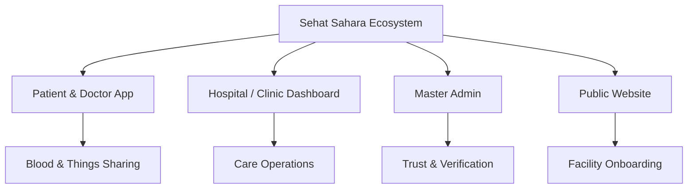

<div align="center">

# 🌿 Sehat Sahara
## صحت سہارا

### Apnon ki sehat. Sab ka sahara.
**One place. More connected care.**

A connected healthcare ecosystem designed for Pakistan — bringing patients, doctors, hospitals, clinics and community support into one shared vision.

<br>

<a href="https://sehat-sahara.vercel.app/">
  
</a>

<a href="https://sehat-sahara-mobile.vercel.app/">
  
</a>

<a href="https://sehat-sahara-dashboard.vercel.app/">
  
</a>

<a href="https://sehat-sahara-admin.vercel.app/">
  
</a>

<br><br>

**Patient & Doctor App · Hospital/Clinic Dashboard · Admin Dashboard · Public Website**

</div>

---

## 🇵🇰 Built for the people behind every healthcare journey

A son trying to find the right doctor for his mother.

A family forwarding a blood request from one WhatsApp group to another.

A young doctor searching for an opportunity to put years of education into practice.

A clinic managing appointments, queues and patient information through scattered tools.

Different people. Different struggles. One healthcare system.

**Sehat Sahara starts with a simple belief: getting help should feel less difficult, and nobody should have to navigate healthcare alone.**

We are building a shared platform where finding care, providing care, managing facilities and helping the community can become parts of the same journey.

> **Sehat sab ki. Sahara hum sab ka.**

---

## 💚 What does “Sehat Sahara” mean?

**Sehat** means health.  
**Sahara** means support.

Together, they represent practical support when someone needs care, clarity or a helping hand.

In Pakistan, looking after someone’s health is often a family effort. Children arrange appointments for parents. Friends search for blood donors. Relatives help find trusted doctors.

That care already exists.

**Our mission is to help it reach people more easily.**

🌐 **[Explore the Sehat Sahara vision →](https://sehat-sahara.vercel.app/)**

---

## 🚀 Explore the complete ecosystem

| Platform | Purpose | Live Link |
|---|---|---|
| 🌿 **Official Website** | Vision, features and hospital onboarding | **[Visit Website →](https://sehat-sahara.vercel.app/)** |
| 📱 **Patient & Doctor App** | Mobile healthcare experience for patients and providers | **[Open App →](https://sehat-sahara-mobile.vercel.app/)** |
| 🏥 **Hospital / Clinic Dashboard** | Facility operations and healthcare management | **[Open Dashboard →](https://sehat-sahara-dashboard.vercel.app/)** |
| 🛡️ **Master Admin Dashboard** | Verification, access and platform management | **[Open Admin →](https://sehat-sahara-admin.vercel.app/)** |

---

## 🧩 One ecosystem, four dedicated experiences

Healthcare involves more than the person booking an appointment. It also involves the doctor providing care, the facility coordinating it and the people responsible for trust and accountability.

Sehat Sahara brings these perspectives into one product vision.

| Experience | Who it serves | What it brings together |
|---|---|---|
| 📱 **[Patient App](https://sehat-sahara-mobile.vercel.app/)** | Individuals, families and caregivers | Finding care, appointments, records, reminders and community support |
| 🩺 **[Doctor App](https://sehat-sahara-mobile.vercel.app/)** | Doctors and healthcare providers | Availability, appointments, consultation workflows and professional opportunities |
| 🏥 **[Hospital / Clinic Dashboard](https://sehat-sahara-dashboard.vercel.app/)** | Facility owners and operational teams | Doctors, patients, bookings, queues, services and schedules |
| 🛡️ **[Master Admin](https://sehat-sahara-admin.vercel.app/)** | Platform administrators | Provider review, facility accounts, user management and platform oversight |



---

## 📱 [Patient Experience](https://sehat-sahara-mobile.vercel.app/)
### Care for yourself. Care for your people.

The patient experience brings everyday healthcare tasks into a familiar mobile interface.

- **Find Care:** Explore doctors, hospitals, clinics and services.
- **Doctor Profiles:** View provider information before choosing care.
- **Appointments:** Follow booking and appointment management flows.
- **Care Profiles:** Organize care for yourself and family members.
- **Medical Records:** Explore record management and sharing interfaces.
- **Medicine Reminders:** Keep treatment routines visible.
- **Community:** Access Blood Sharing and Things Sharing.
- **SOS:** Explore the emergency support demo interface.
- **AI Assistant:** Preview the planned health guidance experience.
- **Notifications:** Stay informed about appointments and activity.
- **Language Options:** Explore English, Urdu and Roman Urdu experiences.

**The goal:** fewer scattered steps when a family is already worried.

### 📲 [Open the Patient App →](https://sehat-sahara-mobile.vercel.app/)

---

## 🩺 [Doctor Experience](https://sehat-sahara-mobile.vercel.app/)
### Support the people who care for everyone else.

Doctors need organized workflows, professional visibility and meaningful opportunities to contribute.

The doctor experience includes:

- Professional profile and verification status
- Availability and consultation settings
- Upcoming and current appointments
- Patient and appointment details
- Consultation notes and prescription interfaces
- Notifications and account settings
- Blood and Things Sharing participation
- Jobs and provider opportunity screens
- Controlled unavailable states for incomplete workflows

### Connecting doctors with facilities

Our longer-term direction includes helping doctors discover suitable work and helping hospitals or clinics find relevant talent.

This can support:

- Fresh medical graduates
- Doctors looking for new opportunities
- Returning healthcare professionals
- Facilities requiring suitable providers
- Doctors seeking flexible or location-based work

**Opportunity screens are included in the demo. A complete matching and employment lifecycle is part of future development.**

### 🩺 [Open the Doctor App →](https://sehat-sahara-mobile.vercel.app/)

---

## 🏥 [Hospital & Clinic Dashboard](https://sehat-sahara-dashboard.vercel.app/)
### More time for care. Less confusion around it.

The facility dashboard demonstrates a shared workspace for daily hospital and clinic operations.

### Core facility modules

- Dashboard overview
- Doctor management
- Patient management
- Appointments and booking actions
- Queue and check-in interfaces
- Patient record access
- Consent-based medical files
- Departments
- Services
- Doctor and facility schedules
- Billing-related screens
- Hiring and applicant management
- Clinic profile
- Notifications and settings

### How facility onboarding is intended to work

1. A hospital or clinic visits the **[Sehat Sahara website](https://sehat-sahara.vercel.app/)**.
2. The facility submits an onboarding request.
3. The Sehat Sahara team contacts the facility.
4. The team understands its services, departments and operational needs.
5. A suitable dashboard workspace is configured.
6. Authorized staff receive account credentials.
7. The facility accesses its **[Hospital/Clinic Dashboard](https://sehat-sahara-dashboard.vercel.app/)**.

This is currently a team-assisted onboarding model. The website demonstrates the request interface, while automated account provisioning belongs to the next stage.

### 🏥 [Open the Hospital / Clinic Dashboard →](https://sehat-sahara-dashboard.vercel.app/)

---

## 🛡️ [Master Admin Dashboard](https://sehat-sahara-admin.vercel.app/)
### Trust needs people, processes and accountability.

Healthcare platforms require verification, access control and responsible platform management.

The Master Admin experience demonstrates:

- Platform overview and activity
- Doctor management
- Doctor verification and review
- User management
- Hospital and clinic account management
- Facility account creation
- Facility account details
- Account activation and suspension controls
- Platform access management
- Basic moderation workflows
- Navigation across administrative modules

These screens show how platform governance is intended to work. Production verification will require real document checks, secure permissions, audit trails and accountable operational processes.

### 🛡️ [Open the Master Admin Dashboard →](https://sehat-sahara-admin.vercel.app/)

---

## 🤝 Community Support
### Kabhi kisi ka sahara banna bhi bohat bari madad hoti hai.

Community is not an extra feature in Sehat Sahara. It is part of the healthcare ecosystem.

### 🩸 Blood Sharing

A focused space for:

- Creating blood requests
- Viewing active requests
- Donor participation
- Request details
- Community coordination

Our intended role is to improve coordination between people seeking support and people willing to help.

Medical eligibility, blood screening, compatibility and transfusion decisions must remain with qualified healthcare professionals and authorized blood services.

📱 **[Explore Blood Sharing in the App →](https://sehat-sahara-mobile.vercel.app/)**

### ♿ Things Sharing

A space for sharing or borrowing useful healthcare items, such as:

- Wheelchairs
- Walkers
- Crutches
- Mobility aids
- Other useful care equipment

The vision is practical: help an available item reach someone who needs it through clear and responsible coordination.

There is no noisy social feed and no bidding marketplace in the current scope.

📱 **[Explore Things Sharing →](https://sehat-sahara-mobile.vercel.app/)**

---

## 🤖 AI with a clear purpose

Health information can become difficult to understand when someone is anxious, unwell or unfamiliar with medical terms.

Our planned AI layer will help users:

- Describe health concerns in familiar language
- Understand general health information
- Organize information before seeking care
- Navigate relevant services
- Recognize situations requiring professional attention
- Recognize possible emergency warning signs
- Prepare useful information for a doctor
- Access healthcare guidance in simpler language

### Language should make care easier

Our language vision includes:

- **English**
- **اردو**
- **Roman Urdu**

Language support is still evolving and requires testing with real users across Pakistan.

### Current AI status

The current product contains AI-related interface demonstrations.

**Live AI is not integrated yet.**

Before real-world use, health guidance features will require:

- Clinical review
- Safety evaluation
- Privacy controls
- Clear limitations
- Reliable emergency escalation
- Human oversight
- Continuous monitoring

AI is intended to support understanding and care navigation. It is not intended to replace qualified medical judgment.

📱 **[Explore the AI Assistant Interface →](https://sehat-sahara-mobile.vercel.app/)**

---

## 🌐 [Public Website](https://sehat-sahara.vercel.app/)
### The front door to Sehat Sahara.

The public website introduces the platform, its purpose and the people it serves.

It includes:

- Sehat Sahara’s mission and vision
- Patient experience presentation
- Doctor experience presentation
- Hospital and clinic solutions
- Product feature showcases
- App access
- Hospital dashboard login
- Hospital and clinic onboarding request
- Contact and platform information

Hospitals and clinics can learn about the platform and submit an onboarding request. The Sehat Sahara team can then contact them and understand their operational requirements.

### 🌿 [Visit the Official Website →](https://sehat-sahara.vercel.app/)

---

## 🛠️ What we actually built

During the hackathon, we developed a frontend/demo MVP covering:

- ✅ Patient and Doctor mobile experiences
- ✅ Hospital and Clinic desktop dashboard
- ✅ Master Admin desktop dashboard
- ✅ Public promotional website
- ✅ Hospital onboarding request interface
- ✅ Blood Sharing experience
- ✅ Things Sharing experience
- ✅ Appointment and care management workflows
- ✅ Provider opportunity interfaces
- ✅ Realistic Pakistani demo data
- ✅ Responsive layouts
- ✅ Role-based navigation
- ✅ Selected local interactions
- ✅ Separate live deployments for each product

### Live deployments

- 🌿 **Website:** [sehat-sahara.vercel.app](https://sehat-sahara.vercel.app/)
- 📱 **Patient & Doctor App:** [sehat-sahara-mobile.vercel.app](https://sehat-sahara-mobile.vercel.app/)
- 🏥 **Hospital/Clinic Dashboard:** [sehat-sahara-dashboard.vercel.app](https://sehat-sahara-dashboard.vercel.app/)
- 🛡️ **Master Admin:** [sehat-sahara-admin.vercel.app](https://sehat-sahara-admin.vercel.app/)

### Current implementation boundary

| Area | Current stage |
|---|---|
| Patient and Doctor interfaces | Frontend/demo implementation |
| Hospital/Clinic dashboard | Frontend/demo implementation |
| Master Admin dashboard | Frontend/demo implementation |
| Public website | Frontend deployed |
| Selected booking and management actions | Local/demo interactions |
| Shared production backend | Planned |
| Real-time synchronization | Planned |
| Live AI guidance | Planned |
| Production record security and consent | Requires implementation and validation |
| Real emergency dispatch | Not implemented |
| Live payments | Not implemented |
| Clinical outcomes | Not measured |

Some screens use static data, and feature completeness varies. A visible interface does not mean its complete backend workflow is operational.

**The current demo is not a clinical service.**

---

## 🔗 Why bring everything together?

A booking becomes more useful when the doctor and facility can act on it.

A record becomes more useful when the right professional can access it with permission.

A doctor profile becomes more useful when hospitals can discover suitable talent.

A facility dashboard becomes more useful when appointments and patient journeys connect with it.

A community request becomes more useful when it reaches someone who can respond.

**Our product hypothesis is that shared workflows create more value than isolated features.**

The next stage is to test that hypothesis through real integrations, clinical guidance and focused pilots.

---

## 🔬 Research that leads to better decisions

Sehat Sahara’s direction is informed by Pakistan’s healthcare context and questions around:

- Access to relevant care
- Household cost and healthcare coordination
- Language and digital literacy
- Doctor employment and professional opportunities
- Facility workflows
- Blood availability
- Community support
- Trust and provider verification

Our intended research includes:

- Patients and families
- Doctors and medical professionals
- Fresh medical graduates and students
- Hospital and clinic teams
- People living in cities
- People living in smaller and underserved areas
- Non-medical community members

Survey findings should be published with response counts, dates, participant mix and limitations.

Product assumptions must be tested rather than presented as proven outcomes.

---

## 🚀 After the hackathon

The hackathon gave Sehat Sahara a visible foundation. The next phase must establish reliability, trust and real usefulness.

### 01 — Validate the need

- Consolidate survey responses and interviews
- Test the main journeys with users
- Identify the highest-priority problems
- Work with clinical and facility advisors
- Validate which features people will actually use

### 02 — Connect the core

- Build the shared backend
- Implement secure authentication
- Add role-based access controls
- Synchronize provider availability
- Connect appointments across products
- Add consent-based medical records
- Connect notifications and activity
- Improve reliability and error handling

### 03 — Run a focused pilot

- Work with a small group of clinics and doctors
- Observe real operational workflows
- Measure usability and completed tasks
- Test doctor–facility opportunity matching
- Test patient understanding
- Improve the product through evidence

### 04 — Expand responsibly

- Introduce evaluated AI assistance
- Improve English, Urdu and Roman Urdu support
- Support multiple facilities and branches
- Strengthen community coordination
- Develop secure records and consent systems
- Explore responsible institutional partnerships
- Prepare the platform for wider adoption

A 6–12 month direction will depend on team capacity, funding, clinical support and what pilots teach us.

---

## 📊 What success should look like

We want to measure whether Sehat Sahara helps people complete meaningful healthcare tasks.

Future pilot measures include:

- Time required to find relevant care
- Appointment completion rates
- Appointment cancellation rates
- Staff time spent coordinating bookings
- Successful doctor–facility matches
- Response time to blood requests
- Completion of patient care journeys
- User understanding across languages
- Repeat use by patients, doctors and facilities
- Reliability of notifications
- Accuracy of role-based access
- Safety of AI escalation workflows

**These are planned success measures, not results already achieved.**

---

## 🌱 Building a sustainable future

A long-term healthcare platform needs a practical way to keep serving people.

Potential revenue streams to validate include:

- **Clinic subscriptions** for facility management tools
- **Hospital onboarding and setup services**
- **Premium operational tools**
- **Provider placement or matching fees** where appropriate
- **Responsible transaction fees**
- **Institutional partnerships**
- **Healthcare organization integrations**
- **Enterprise support and customization**

Pricing and commercial models will be tested with partners.

Privacy, trust, safety and useful access must remain central to every decision.

---

## 💻 Running the project locally

The products are maintained in separate project folders.

Open the folder for the product you want to run and check its `package.json` for the available scripts and package manager.

For an npm-based project:

```bash
npm install
npm run dev
```

For a production build:

```bash
npm run build
```

If environment variables are required:

1. Copy the relevant `.env.example`.
2. Add your own local values.
3. Keep the real `.env` file private.
4. Never commit credentials.

Exact setup can vary between product folders.

---

## 🔐 Protect the people behind the data

Healthcare information deserves careful handling from the beginning.

- Use synthetic data in demos and contributions.
- Never commit patient information.
- Never upload private medical records.
- Keep passwords, API keys and tokens out of the repository.
- Add `.env` and `.env.*` files to `.gitignore`.
- Use `.env.example` only for placeholder values.
- Revoke any credential accidentally committed.
- Do not expose personal account information in screenshots.
- Use secure permissions before connecting real records.

Production security and privacy controls must be implemented and reviewed before handling real patient data.

---

## 🤝 Build with us

We welcome people who can help turn this foundation into a dependable healthcare platform:

- Doctors and clinical advisors
- Hospitals and clinics interested in pilots
- Frontend and backend developers
- AI engineers and evaluators
- UI/UX designers
- Accessibility reviewers
- Healthcare researchers
- Community organizations
- Mentors
- Potential partners and investors

For technical contributions, open an issue describing the proposed change before starting substantial work.

For hospital or clinic interest, visit the onboarding section on our website.

### 🏥 [Request Hospital/Clinic Onboarding →](https://sehat-sahara.vercel.app/)

---

## 🔗 Quick Links

| Destination | Link |
|---|---|
| 🌿 Official Website | [Open Website](https://sehat-sahara.vercel.app/) |
| 📱 Patient & Doctor App | [Open Mobile App](https://sehat-sahara-mobile.vercel.app/) |
| 🏥 Hospital / Clinic Dashboard | [Open Facility Dashboard](https://sehat-sahara-dashboard.vercel.app/) |
| 🛡️ Master Admin | [Open Admin Dashboard](https://sehat-sahara-admin.vercel.app/) |

---

## 💚 From the Sehat Sahara Team

We know an interface alone cannot fix healthcare.

There is still engineering to do, research to validate, trust to earn and real-world learning ahead.

But we have started — with a shared product vision and a frontend ecosystem that people can explore, question and improve.

We imagine a Pakistan where:

- A family finds care with less confusion.
- A doctor finds a meaningful opportunity.
- A clinic works with better coordination.
- A patient’s information remains organized.
- A blood request reaches a helping hand sooner.
- Technology supports people without removing the human side of care.

That is the future we want to work toward, **In Sha Allah.**

## Sehat sab ki. Sahara hum sab ka. 🇵🇰

<a href="https://sehat-sahara.vercel.app/">
  
</a>

<a href="https://sehat-sahara-mobile.vercel.app/">
  
</a>

<a href="https://sehat-sahara-dashboard.vercel.app/">
  
</a>

<a href="https://sehat-sahara-admin.vercel.app/">
  
</a>
